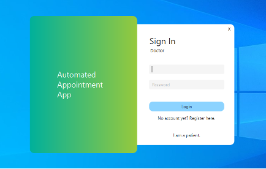
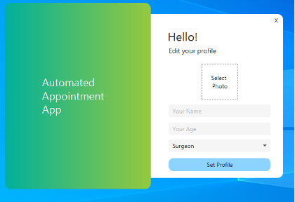
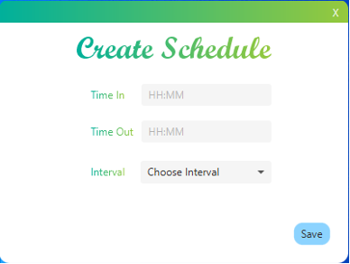
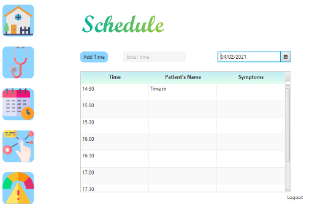
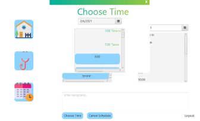
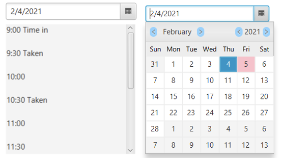
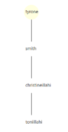
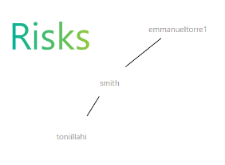

# Doctor-Patient Appointment Desktop App

## Introduction
The pandemic brought major changes in the people lifestyles. Multiple actions are being taken accordingly depending on what the situation demanded. Emphasizing the gravity of the situation, there have been many victims of the pandemic resulting to most of the medical personnels working full-time. With multiple factors stressing out the citizens, it could lead to a lot of confusions with priorities. So, in order to help the doctors as well as the patients in terms of convenience, an appointment app can aid in properly managing the schedule for a said appointment and also lets you know when you can avail for an appointment. 

## Screenshots
### User Login/Registry

### Profile Editor

### Appointment Setting (for Doctor)

### Appointment Setting (for Patient)

### Schedule Checker

### Contact Tracing Visualizer

### Risk Checker

## Data Structures Used
- Stack
- Queue
- Linked List
- Binary Search Tree
- Graphs
- Hashmap
